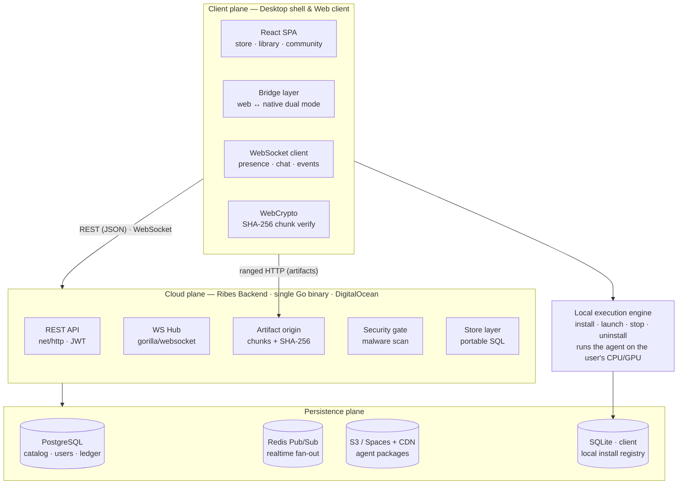
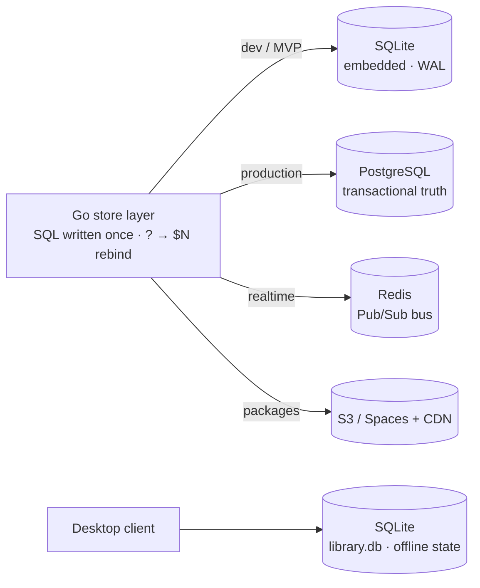
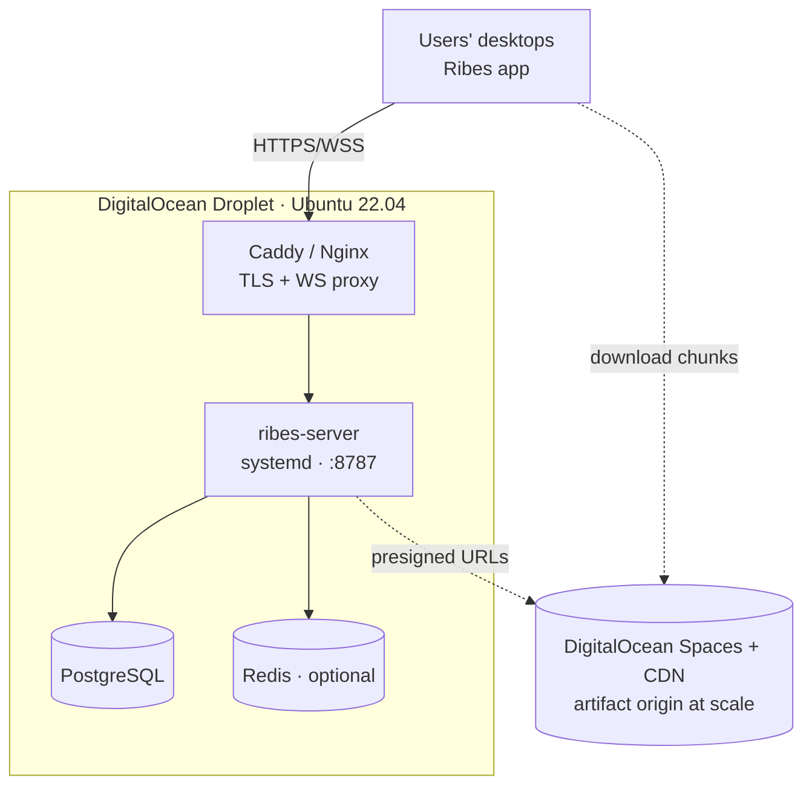

# Ribes — Platform Architecture

> Marketplace **and** execution runtime for local AI agents. Developers publish agents to a cloud catalog; users install them in one click and run them on **their own hardware** — no cloud inference cost, no data leaving the machine. The platform is the connecting core that downloads, verifies, installs, launches, supervises and uninstalls each agent.

**A visual version of this document is [`index.html`](index.html)** — open it in a browser for the full graphical interface (matte, brand-styled, navigable).

       

---

## 1. Bird's-eye — three planes, one Go core

The AI agent itself executes **locally** on the user's CPU/GPU via the platform's local execution engine — the cloud never runs inference.

---

## 2. Full technology map

| Layer | Language | Core tech | Responsibility |
|---|---|---|---|
| **Web / Desktop UI** | TypeScript | React 18 · Vite · Tailwind · Zustand · React Router | SPA: store, library, downloads, community, dev center, settings |
| **Native window** | Rust / Go | Tauri 2 · WebView2 · go-webview2 | Chromeless desktop window, own taskbar identity |
| **Launcher core** | Rust | Tokio · sysinfo · nvml · reqwest · rusqlite · zip | Hardware probe, resumable downloads, process supervision |
| **Marketplace API** | Go 1.23 | net/http · gorilla/websocket · golang-jwt | REST + WebSocket, auth, catalog, licensing, dev center |
| **Data access** | Go | pgx/v5 · modernc.org/sqlite | Portable SQL across PostgreSQL & SQLite profiles |
| **Realtime bus** | Go | redis/go-redis v9 | Pub/Sub fan-out of chat, presence, catalog events |
| **Artifacts** | Go | crypto/sha256 · archive/zip · net/http Range | Content-addressed chunking & verified delivery |
| **Security** | Go | bcrypt · JWT HS256 · regexp heuristics | Password hashing, sessions, malware scan, product gate |
| **Agent SDK** | Python 3.10+ | JSON-RPC 2.0 · JSON Schema · stdlib HTTP | Bridge client + manifest contract for agents |
| **Installer** | Go | WebView2 · gzip · rsrc | Graphical setup wizard, embedded compressed payload |
| **Storage** | — | PostgreSQL · Redis · S3/Spaces + CDN · SQLite | Transactional truth, cache/bus, artifact origin, local state |

---

## 3. Frontend (`client/`)

- **React 18 + Vite + TypeScript** — SPA; the production bundle is embedded into the Go binary via `go:embed`, so the whole platform ships as one file.
- **Tailwind CSS** — matte dark tokens: graphite surfaces, hairline borders, one muted purple accent. Flat fills, no gradients, no emoji icons.
- **Zustand** stores — `session`, `cart`, `downloads`, `social`.
- **React Router (HashRouter)** — identical routing in the browser and the packaged native window.
- **Bridge layer** (`lib/bridge.ts`) — abstracts the runtime: browser → platform API, native → local execution engine.
- **WebSocket + WebCrypto** — auto-reconnecting realtime; SHA-256 chunk verification in-browser.

**Pages:** Auth (+ Google/GitHub) · 3-step Onboarding · Store (facets, hardware gate, recommendations) · Agent Detail · Cart · Library · Downloads (network + disk graphs) · Community (realtime chat) · Publisher profile · Dev Center (5 steps) · Settings (8 sections) · Run-agent deep link.

---

## 4. Backend (`server/`) — one static Go binary

| Package | Responsibility |
|---|---|
| `cmd/ribes-server` | Entry, catalog seed, native window (desktop) |
| `internal/config` | Env config, DB-profile selection |
| `internal/store` | **Database layer** — portable SQL, additive migrations |
| `internal/api` | REST + WS upgrade, JWT auth, CORS |
| `internal/ws` | Realtime hub, Redis Pub/Sub bus |
| `internal/artifacts` | Chunking, SHA-256, ranged delivery |
| `internal/security` | Product contract + malware scan |
| `internal/local` | Embedded execution engine (install/launch/stop/uninstall) |
| `internal/webui` | Embedded client bundle (`go:embed`) |

**Key dependencies:** `golang-jwt/jwt/v5`, `gorilla/websocket`, `jackc/pgx/v5`, `modernc.org/sqlite` (pure-Go, no CGO), `redis/go-redis/v9`, `golang.org/x/crypto/bcrypt`, `google/uuid`, `jchv/go-webview2`.

---

## 5. Data layer — two profiles, one SQL codebase

PostgreSQL is the production source of truth (catalog, licenses, payments ledger, reviews, social graph). Redis fans realtime events across horizontally-scaled instances. The client keeps its own SQLite `library.db` for what is installed on that machine.

---

## 6. Desktop shell, installer & SDK

- **Tauri 2 core (Rust)** — async launcher daemon on Tokio: hardware probe (`sysinfo`, `nvml`), resumable chunked downloads (`reqwest`, `sha2`), SQLite library (`rusqlite`), Job-Object kill-tree.
- **Native window (Go)** — the Go binary can host its own WebView2 window (`go-webview2`): one process, own taskbar icon/title, single-instance.
- **Ribes SDK (Python)** — thin bridge client, JSON-RPC 2.0 over stdio / named pipe / UDS. Agents declare a `ribes.manifest.json` (JSON Schema) and raise the bridge from an entrypoint.
- **SetupRibes.exe** — graphical WebView2 wizard in Go; the platform binary travels gzip-compressed inside; per-user install (no admin), SHA-256 verified, shortcuts, plus a `--silent` mode.

**Bridge protocol** — agent → core: `ready`, `status`, `progress`, `metric`, `log`, `output`; core → agent: `shutdown`, `cancel`, `request_input`.

---

## 7. Key data flows

**Install & launch pipeline**
1. License gate → signed `download-plan` (chunks, SHA-256, CDN URLs).
2. Verified download — ranged HTTP, SHA-256 per chunk, live WebSocket progress.
3. Install — unpack into managed library, record real size, create Desktop shortcut → `Ribes --run-agent <id>`.
4. Launch / stop / uninstall — platform supervises the process; graceful shutdown then kill-tree; uninstall removes files, shortcut and process.

**Publish · pay · realtime**
- **Publish** — upload → security scan → moderation → `catalog_changed` fanned out.
- **Payment** — wallet-first checkout; paid sale credits the developer **70%** instantly in the ledger (30% commission).
- **Realtime** — chat/presence/notifications → Redis → WebSocket fan-out.
- **Recommendations** — scored from library affinity + friends' libraries + rating + hardware gate.

---

## 8. Database schema (core tables)

| Table | Holds |
|---|---|
| `users` | account, bcrypt hash, wallet balance, cards, API key |
| `hardware_profiles` | CPU/GPU/RAM/VRAM/disk/OS per user (store gate) |
| `agents` | catalog entry: name, category, price, `size_bytes`, status, icon |
| `agent_hardware` | min/recommended VRAM/RAM, backends, CPU fallback |
| `agent_versions` | version history & changelog |
| `artifact_chunks` | content-addressed chunk hashes per version |
| `licenses` | ownership per user × agent |
| `transactions` | payments ledger: topup / purchase / sale_income / withdrawal |
| `reviews` | one rating + body per user × agent |
| `friendships` | social graph (pending / accepted) |
| `messages` | direct-message history |
| `builds` · `activity` · `notifications` | dev builds, feed, alerts |

---

## 9. Security model

| Area | Measures |
|---|---|
| **Identity** | bcrypt hashing · JWT HS256 sessions · OAuth (Google/GitHub), persistent accounts |
| **Artifact integrity** | content-addressed 4 MiB chunks · SHA-256 verified before accept · zip-slip guards |
| **Upload gate** | product contract (runnable entrypoint) · heuristic malware scan · explicit findings |
| **Execution isolation** | process sandbox + scoped env · kill-tree frees VRAM · egress denied by default |
| **Payments** | only card last-4 stored · full ledger · separate developer payout card |
| **Privacy** | inference is local — prompts never leave the device · CSP on the agent webview |

---

## 10. MVP deployment — Ubuntu + DigitalOcean

| Step | Action |
|---|---|
| 1 · Build | `CGO_ENABLED=0 go build -ldflags "-s -w" -o ribes-server ./cmd/ribes-server` → one ~16 MB binary |
| 2 · Database | `CREATE DATABASE ribes;` — migrations apply automatically on first start |
| 3 · Configure | env: `RIBES_DATABASE_URL` · `RIBES_REDIS_URL` · `RIBES_JWT_SECRET` · `RIBES_SEED=0` · `RIBES_LOCAL_LAUNCH=0` |
| 4 · Service | systemd unit, `Restart=always`, runs as user `ribes` |
| 5 · TLS | Caddy: `api.your-domain { reverse_proxy 127.0.0.1:8787 }` — WS passes through |
| 6 · Artifacts | Filesystem for MVP → DigitalOcean Spaces (S3) + CDN as traffic grows |
| 7 · Scale | N instances behind the proxy sharing PostgreSQL + Redis; the bus keeps chat/presence consistent |

Because the backend is a **single static binary** with automatic migrations, the MVP needs no container orchestration and no SRE team — one Ubuntu droplet, PostgreSQL, and a reverse proxy are enough to go live.

---

* from the live Ribes codebase. Languages: Go · TypeScript · Rust · Python. Data: PostgreSQL · Redis · SQLite · S3/CDN. Inference runs on the user's own hardware; the platform is the connecting core.*
